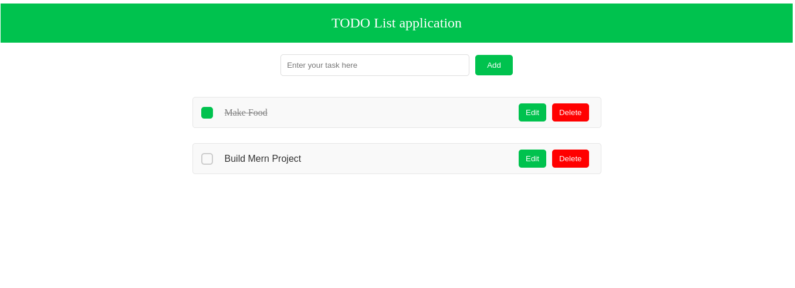

# Full Stack Todo List Application

A simple and intuitive Todo List application built using the MERN (MongoDB, Express, React, Node.js) stack. This application allows users to create, update, and delete tasks, providing a seamless user experience for managing daily tasks and activities.

## Features

- Create, update, and delete tasks easily.
- Mark tasks as complete or pending.
- Intuitive user interface for efficient task management.
- Data persistence using MongoDB for seamless data storage.
- Responsive design for optimal user experience across devices.

## Technologies Used

- MongoDB: A NoSQL database used for data storage.
- Express: A fast, minimalist web framework for Node.js used for building the application backend.
- React: A JavaScript library for building user interfaces used for the application frontend.
- Node.js: A JavaScript runtime used for building scalable server-side applications.

## Installation

To run this application locally, follow these steps:

1. Clone the repository:

   ```
   git clone https://github.com/devpdhana/Todo-full-stack-application.git
   ```

2. Navigate to the project directory:

   ```
   cd client
   ```

3. Install the dependencies:

   ```
   npm install
   ```

4. Start the development server:

   ```
   npm run dev
   ```

5. Open your web browser and visit `http://localhost:5713` to view the application.

## Contribution

Contributions are welcome! If you find any issues or want to enhance the application, feel free to create a pull request.

1. Fork the repository
2. Create your feature branch: `git checkout -b feature/YourFeature`
3. Commit your changes: `git commit -am 'Add some feature'`
4. Push to the branch: `git push origin feature/YourFeature`
5. Submit a pull request


## Acknowledgements

- [MongoDB](https://www.mongodb.com/)
- [Express](https://expressjs.com/)
- [React](https://reactjs.org/)
- [Node.js](https://nodejs.org/)

## Screenshots




## Author

devpdhana
devpdhanasekar@gmail.com

---

Feel free to modify and customize the template according to your project's specific requirements.
